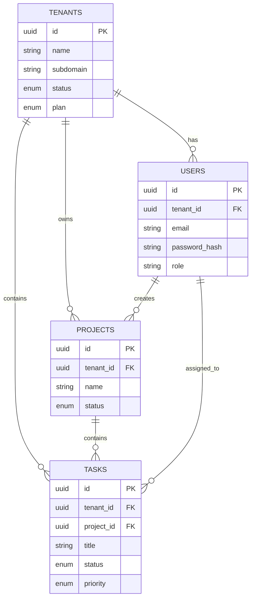

# Architecture Document

## System Architecture

```mermaid
graph TD
    Client[Web Client (React)] -->|HTTPS/JSON| API[Backend API (Node/Express)]
    API -->|Read/Write| DB[(PostgreSQL Database)]
    API -->|Auth| JWT[JWT Manager]
    
    subgraph Docker Network
    API
    DB
    end
```

## Database Schema Design (ERD)



## API Architecture

### Authentication
- `POST /api/auth/register-tenant` (Public)
- `POST /api/auth/login` (Public)
- `GET /api/auth/me` (Auth)
- `POST /api/auth/logout` (Auth)

### Tenants
- `GET /api/tenants/:id` (Admin/Super)
- `PUT /api/tenants/:id` (Admin/Super)
- `GET /api/tenants` (Super)

### Users
- `POST /api/tenants/:id/users` (Admin)
- `GET /api/tenants/:id/users` (Auth)
- `PUT /api/users/:id` (Admin/Self)
- `DELETE /api/users/:id` (Admin)

### Projects
- `POST /api/projects` (Auth)
- `GET /api/projects` (Auth)
- `PUT /api/projects/:id` (Auth)
- `DELETE /api/projects/:id` (Auth)

### Tasks
- `POST /api/projects/:id/tasks` (Auth)
- `GET /api/projects/:id/tasks` (Auth)
- `PATCH /api/tasks/:id/status` (Auth)
- `PUT /api/tasks/:id` (Auth)

## System Architecture
(Add image: architecture.png)

## Database ER Diagram
(Add image: er-diagram.png)

## API List
1. POST /auth/register-tenant
2. POST /auth/login
3. GET /users
...
19. GET /audit-logs
